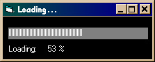



## Easy Progress Bar

### Description

Make an easy progress bar using only a label, timer, and a few lines of code. No .ocx needed!...
 
### More Info
 

             |
---                |---
**Submitted On**   |2000-11-17 21:25:14
**By**             |[zach smith](https://github.com/Planet-Source-Code/PSCIndex/blob/master/ByAuthor/zach-smith.md)
**Level**          |Beginner
**User Rating**    |3.8 (19 globes from 5 users)
**Compatibility**  |VB 4\.0 \(32\-bit\), VB 5\.0, VB 6\.0
**Category**       |[Miscellaneous](https://github.com/Planet-Source-Code/PSCIndex/blob/master/ByCategory/miscellaneous__1-1.md)
**World**          |[Visual Basic](https://github.com/Planet-Source-Code/PSCIndex/blob/master/ByWorld/visual-basic.md)
**Archive File**   |[CODE\_UPLOAD1181011182000\.zip](https://github.com/Planet-Source-Code/zach-smith-easy-progress-bar__1-12919/archive/master.zip)

